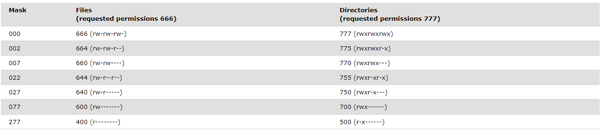

# Zadania z C z przedmioty Systemy Operacyjne

Kompilacja - `gcc -Wall kod.c -o kod`

## Pojecia 

`Proces` - Program uruchamiany przez uzytkownika lub system. Proces sklada sie z kodu programu, danych, kontekstu wykonywania i innych potrzebnych zasobów. 

`Watek` = Znany rowniez jako lekki proces, jest lzejsza jednostka wykonawcza niz proces. Wątki działają w kontekscie procesu i wspoldziela z nim zasoby. Wykonuja sie rownolegle w ramach jednego procesu. 

`Sygnal` - Komunikat asynchroniczny wysylany do procesu lub do watku w celu poinformowania go, że wystepuje jakies zdarzenie. (Przerwanie, blad, zadanie zakonczenia itp).

`Semafor` - Mechanizm synchronizacji uzywany w systemie operacyjnym. Moze miec wartosc 0 lub 1. Procesy moga wywolywac operacje na semaforach takie jak proba zblokowania i oczekiwanie na zasób lub zwolnienie zasobu. Semafor zapewnia tylko jeden proces lub watek.

## Umask

